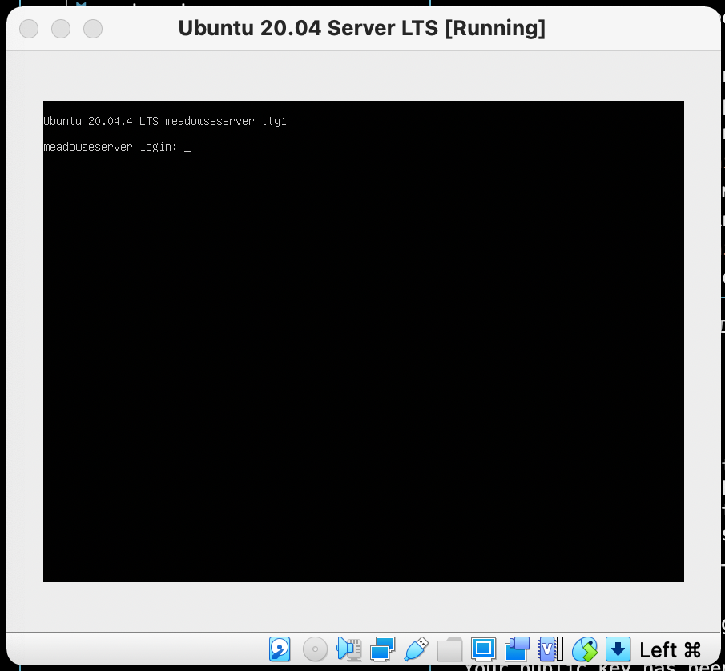
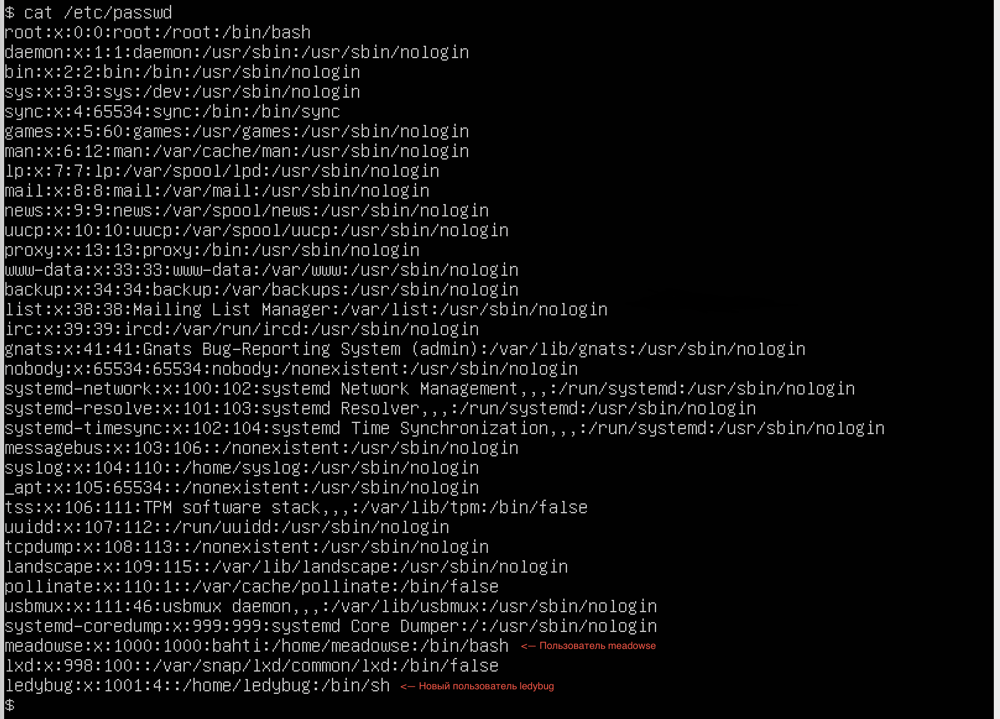
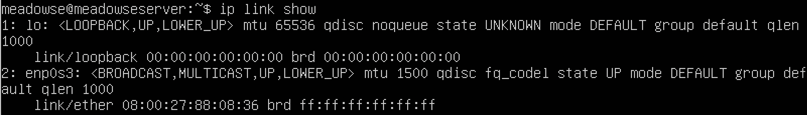
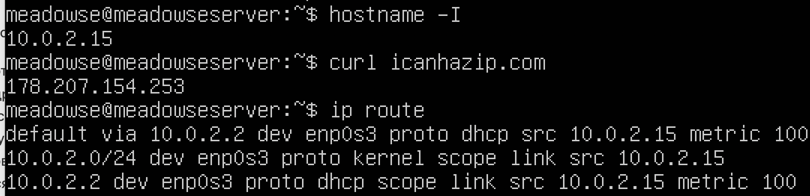

## Part 1. Установка ОС

Вывод версии Ubuntu с помощью команды cat /etc/issue.

## Part 2. Создание пользователя

Команда создания нового пользователя

Вывод пользователей командой cat /etc/passwd

## Part 3. Настройка сети ОС

1. Задать им машины вида user-1
команда: `sudo hostnamectl set-hostname user-1`
2. Поменять дату и время в зависимости от территориального расположения машины. Команда: 
* `timedatectl` - показывает информацию о дате, времени и часовом поясе. 
* `sudo timedatectl set-timezone Europe/Moscow`

3. Вывести названия сетевых интерфейсов с помощью консольной команды. И дать обьяснение  интерфейсу lo.
* lo - это аппаратный или программный метод, который направляет полученный сигнал или данные обратно отправителю. Он используется как дополнительное средство в исправлении проблем физического соединения.
Команда для вывода сетевых интерфейсов:
`ip link show`

4. Иcпользуя консольную команду получить ip адресс устройства. На котором я работаю от DHCP сервера. И дать расшифровку DHCP.
* `DCHP` (Dynamic Host Configuration Protocol) — протокол динамической настройки узла) — прикладной протокол, позволяющий сетевым устройствам автоматически получать IP-адрес и другие параметры, необходимые для работы в сети TCP/IP. Данный протокол работает по модели «клиент-сервер». Для автоматической конфигурации компьютер-клиент на этапе конфигурации сетевого устройства обращается к так называемому серверу DHCP и получает от него нужные параметры. Сетевой администратор может задать диапазон адресов, распределяемых сервером среди компьютеров. Это позволяет избежать ручной настройки компьютеров сети и уменьшает количество ошибок. Протокол DHCP используется в большинстве сетей TCP/IP.
* `hostname -I` - показать внутренний ip адрес устройства | у меня это 10.0.2.15
* `curl icanhazip.com` - узнать внешний ip адрес устройства | у меня это 178.207.154.253
* `ip route` - показать ip адрес шлюза (gateway - он же внутренний ip)

 6. Задать статичные (заданные вручную, а не полученные от DHCP сервера) настройки ip, gw, dns (использовать публичный DNS серверы, например 1.1.1.1 или 8.8.8.8).Команды: 
* Выше мы узнали адрес шлюза командой ` ip route`.
* Ввести команду `sudo vim /etc/netplan/00-installer-config.yaml` и внести изменения

* после сохраняем изменения командой `sudo netplan apply`
* перезагружаем машину командой `sudo reboot` и проверяем ip машины.

##### Перезагрузить виртуальную машину. Убедиться, что статичные сетевые настройки (ip, gw, dns) соответствуют заданным в предыдущем пункте.  

- В отчёте опишите, что сделали для выполнения всех семи пунктов (можно как текстом, так и скриншотами).
- Успешно пропинговать удаленные хосты 1.1.1.1 и ya.ru и вставить в отчёт скрин с выводом команды.

## Part 4. Обновление ОС

`-` Ты спросишь меня: "Готова ли теперь система?". Не готова она совсем! Мы же ещё не обновили её до последней версии.

**== Задание ==**

##### Обновить системные пакеты до последней на момент выполнения задания версии.  

- После обновления системных пакетов, если ввести команду обновления повторно, должно появится сообщение, что обновления отсутствуют.
- Вставить скриншот с этим сообщением в отчёт.

## Part 5. Использование команды **sudo**

`-` Как часто тебе в детстве говорили, что ты забыл сказать "волшебное" слово? Одним из таких "волшебных" слов было "пожалуйста". В Linux есть его аналог - _sudo_. Система не станет выполнять некоторые операции, пока не услышит "волшебное" слово.

**== Задание ==**

##### Разрешить пользователю, созданному в [Part 2](#part-2-создание-пользователя), выполнять команду sudo.

- В отчёте объяснить *истинное* назначение команды sudo (про то, что это слово - "волшебное", писать не стоит).  
- Поменять hostname ОС от имени пользователя, созданного в пункте [Part 2](#part-2-создание-пользователя) (используя sudo).
- Вставить скрин с изменённым hostname в отчёт.

## Part 6. Установка и настройка службы времени

`-` Хоть у нас сейчас и стоит правильное время, оно может быть таким не всегда. Чтобы не настраивать его каждый раз самим, существуют службы синхронизации времени.

**== Задание ==**

##### Настроить службу автоматической синхронизации времени.  

- Вывести время, часового пояса, в котором вы сейчас находитесь.
- Вывод следующей команды должен содержать `NTPSynchronized=yes`: \
  `timedatectl show`
- Вставить скрины с корректным временем и выводом команды в отчёт.

## Part 7. Установка и использование текстовых редакторов 

`-` Думаю мы готовы перейти к одному из самых страшных этапов. На висящей на стене карте мира, вы указываете в сторону Нидерландов.

`-` Здесь, Брам Моленар разгадал тайны гармонии и внутренней концентрации. \
Именно здесь, 2 ноября 1991 года, вышла первая версия VIM. \
Ты хочешь научиться работать в VIM?

`-` Да.

`-` Тогда я и есть твой мастер.

`-` Хорошо...

`-` Только не плачь.

`-` Ладно..

**== Задание ==**

##### Установить текстовые редакторы **VIM** (+ любые два по желанию **NANO**, **MCEDIT**, **JOE** и т.д.)  
##### Используя каждый из трех выбранных редакторов, создайте файл *test_X.txt*, где X -- название редактора, в котором создан файл. Напишите в нём свой никнейм, закройте файл с сохранением изменений.  
- В отчёт вставьте скриншоты:
  - Из каждого редактора с содержимым файла перед закрытием.
- В отчёте укажите, что сделали для выхода с сохранением изменений.
##### Используя каждый из трех выбранных редакторов, откройте файл на редактирование, отредактируйте файл, заменив никнейм на строку "21 School 21", закройте файл без сохранения изменений.
- В отчёт вставьте скриншоты:
    - Из каждого редактора с содержимым файла после редактирования.
- В отчёте укажите, что сделали для выхода без сохранения изменений.
##### Используя каждый из трех выбранных редакторов, отредактируйте файл ещё раз (по аналогии с предыдущим пунктом), а затем освойте функции поиска по содержимому файла (слово) и замены слова на любое другое.
- В отчёт вставьте скриншоты:
    - Из каждого редактора с результатами поиска слова.
    - Из каждого редактора с командами, введёнными для замены слова на другое.

## Part 8. Установка и базовая настройка сервиса **SSHD**

`-` Удобно иметь доступ от одного компьютера к другому по сети, правда? Но чтобы это было не только удобно, но и безопасно, стоит использовать сервис SSH.

**== Задание ==**

##### Установить службу SSHd.  
##### Добавить автостарт службы при загрузке системы.  
##### Перенастроить службу SSHd на порт 2022.  
##### Используя команду ps, показать наличие процесса sshd. Для этого к команде нужно подобрать ключи.
- В отчёте объяснить значение команды и каждого ключа в ней.
##### Перезагрузить систему.
- В отчёте опишите, что сделали для выполнения всех пяти пунктов (можно как текстом, так и скриншотами).
- Вывод команды netstat -tan должен содержать  \
`tcp 0 0 0.0.0.0:2022 0.0.0.0:* LISTEN`  \
(если команды netstat нет, то ее нужно установить)
- Скрин с выводом команды вставить в отчёт.
- В отчёте объяснить значение ключей -tan, значение каждого столбца вывода, значение 0.0.0.0.

## Part 9. Установка и использование утилит **top**, **htop**

`-` Если бы меня спросили, что полезного делают утилиты **top** и **htop**, я бы ответил одним словом - всё.

**== Задание ==**

##### Установить и запустить утилиты top и htop.  

- По выводу команды top определить и написать в отчёте:
  - uptime
  - количество авторизованных пользователей
  - общую загрузку системы
  - общее количество процессов
  - загрузку cpu
  - загрузку памяти
  - pid процесса занимающего больше всего памяти
  - pid процесса, занимающего больше всего процессорного времени
- В отчёт вставить скрин с выводом команды htop:
  - отсортированному по PID, PERCENT_CPU, PERCENT_MEM, TIME
  - отфильтрованному для процесса sshd
  - с процессом syslog, найденным, используя поиск 
  - с добавленным выводом hostname, clock и uptime  

## Part 10. Использование утилиты **fdisk**

`-` Теперь давай разберёмся, как получить информацию о жёстком диске. Специально для тебя я собрал пару примеров работы с утилитой fdisk.

**== Задание ==**

##### Запустить команду fdisk -l.

- В отчёте написать название жесткого диска, его размер и количество секторов, а также размер swap.

## Part 11. Использование утилиты **df** 

`-` Информацию о жёстком диске мы получили, но, зачастую, куда интереснее информация о дисковом пространстве, которую можно получить с помощью утилиты df.

**== Задание ==**

##### Запустить команду df.  
- В отчёте написать для корневого раздела (/):
  - размер раздела
  - размер занятого пространства
  - размер свободного пространства
  - процент использования
- Определить и написать в отчёт единицу измерения в выводе.  

##### Запустить команду df -Th.
- В отчёте написать для корневого раздела (/):
    - размер раздела
    - размер занятого пространства
    - размер свободного пространства
    - процент использования
- Определить и написать в отчёт тип файловой системы для раздела.

## Part 12. Использование утилиты **du**

`-` df - не единственный способ поучить информацию о дисковом пространстве. Сейчас расскажу про ещё один.

**== Задание ==**

##### Запустить команду du.
##### Вывести размер папок /home, /var, /var/log (в байтах, в человекочитаемом виде)
##### Вывести размер всего содержимого в /var/log (не общее, а каждого вложенного элемента, используя *)

- В отчёт вставить скрины с выводом всех использованных команд.

## Part 13. Установка и использование утилиты **ncdu**

`-` Тебе, возможно, не очень понравился формат, в котором команда du выводит информацию. Я тебя прекрасно понимаю. Поэтому сейчас мы рассмотрим её улучшенную версию.

**== Задание ==**

##### Установить утилиту ncdu.
##### Вывести размер папок /home, /var, /var/log.

- Размеры должны примерно совпадать с полученными в [Part 12](#part-12-использование-утилиты-du).

- В отчёт вставить скрины с выводом использованных команд.

## Part 14. Работа с системными журналами

`-` Системному администратору иногда приходится просматривать события, происходившие в системе в недавнем прошлом. Для этого в Linux есть системные журналы.

**== Задание ==**

##### Открыть для просмотра:
##### 1. /var/log/dmesg
##### 2. /var/log/syslog
##### 3. /var/log/auth.log  

- Написать в отчёте время последней успешной авторизации, имя пользователя и метод входа в систему.
- Перезапустить службу SSHd.
- Вставить в отчёт скрин с сообщением о рестарте службы (искать в логах).

## Part 15. Использование планировщика заданий **CRON**

`-` Фух, наконец-то мы добрались до последней части моего долгого повествования. Сейчас я покажу программу, которая, помимо прочего, заметно упрощает периодический вызов других программ.

**== Задание ==**

##### Используя планировщик заданий, запустите команду uptime через каждые 2 минуты.
- Найти в системных журналах строчки (минимум две в заданном временном диапазоне) о выполнении.
- Вывести на экран список текущих заданий для CRON.
- Вставить в отчёт скрины со строчками о выполнении и списком текущих задач.

##### Удалите все задания из планировщика заданий.
- В отчёт вставьте скрин со списком текущих заданий для CRON.
