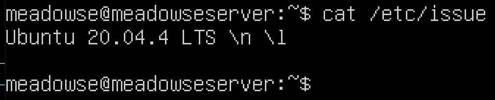
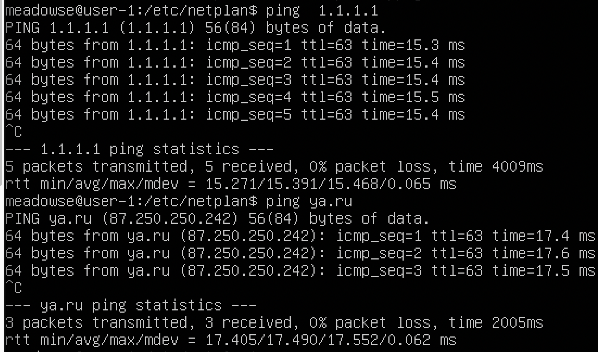

## Part 1. Установка ОС

Вывод версии Ubuntu с помощью команды cat /etc/issue.

## Part 2. Создание пользователя

Команда создания нового пользователя

Вывод пользователей командой cat /etc/passwd

## Part 3. Настройка сети ОС

1. Задать им машины вида user-1
команда: `sudo hostnamectl set-hostname user-1`
2. Поменять дату и время в зависимости от территориального расположения машины. Команда: 
* `timedatectl` - показывает информацию о дате, времени и часовом поясе. 
* `sudo timedatectl set-timezone Europe/Moscow`

3. Вывести названия сетевых интерфейсов с помощью консольной команды. И дать обьяснение  интерфейсу lo.
* lo - это аппаратный или программный метод, который направляет полученный сигнал или данные обратно отправителю. Он используется как дополнительное средство в исправлении проблем физического соединения.
Команда для вывода сетевых интерфейсов:
`ip link show`

4. Иcпользуя консольную команду получить ip адресс устройства. На котором я работаю от DHCP сервера. И дать расшифровку DHCP.
* `DCHP` (Dynamic Host Configuration Protocol) — протокол динамической настройки узла) — прикладной протокол, позволяющий сетевым устройствам автоматически получать IP-адрес и другие параметры, необходимые для работы в сети TCP/IP. Данный протокол работает по модели «клиент-сервер». Для автоматической конфигурации компьютер-клиент на этапе конфигурации сетевого устройства обращается к так называемому серверу DHCP и получает от него нужные параметры. Сетевой администратор может задать диапазон адресов, распределяемых сервером среди компьютеров. Это позволяет избежать ручной настройки компьютеров сети и уменьшает количество ошибок. Протокол DHCP используется в большинстве сетей TCP/IP.
* `hostname -I` - показать внутренний ip адрес устройства | у меня это 10.0.2.15
* `curl icanhazip.com` - узнать внешний ip адрес устройства | у меня это 178.207.154.253
* `ip route` - показать ip адрес шлюза (gateway - он же внутренний ip)

 6. Задать статичные (заданные вручную, а не полученные от DHCP сервера) настройки ip, gw, dns (использовать публичный DNS серверы, например 1.1.1.1 или 8.8.8.8).Команды: 
* Выше мы узнали адрес шлюза командой ` ip route`.
* Ввести команду `sudo vim /etc/netplan/00-installer-config.yaml` и внести изменения

* после сохраняем изменения командой `sudo netplan apply`
* перезагружаем машину командой `sudo reboot` и проверяем ip машины.

7.
* Успешно пропинговать командой `ping 1.1.1.1` и `ping ya.ru`

## Part 4. Обновление ОС

1. Обновить пакеты убунту
* `sudo apt-get update` Обновляет индекс пакетов системы
* `sudo apt-get upgrade` Обновляет все устаревшие пакеты до последних версий
* После обновления системных пакетов, если ввести команду обновления повторно, должно появится сообщение, что обновления отсутствуют

## Part 5. Использование команды **sudo**

* Команда sudo предоставляет возможность пользователям выполнять команды от имени суперпользователя root, либо других пользователей. Правила, используемые sudo для принятия решения о предоставлении доступа, находятся в файле `/etc/sudoers` (для редактирования файла можно использовать специальный редактор visudo, запускаемый из командной строки без параметров, в том числе без указания пути к файлу); язык их написания и примеры использования подробно изложены в man sudoers).Имя команды означает substitute user do или super user do. Утилита позволяет запускать программы от имени другого пользователя, но чаще всего от имени корневого. Утилита была разработана еще в 1980 году Бобом Когшелом и Клиффом Спенсером. За это время сменилось много разработчиков и было добавлено много функций.

Поменять hostname ОС от имени пользователя, созданного в пункте Part 2. (используя sudo).
* Добавляем пользователя ladybug в группу sudo:  `sudo usermod -aG sudo ladybug`
* Проверяем все ли получилось: `id ladybug`, также залогинимся на "ladybug" `su ladybug` и запустим команду  `sudo -l`, далее изменим имя машины на "user-3":
`sudo hostnamectl set-hostname user-3`

## Part 6. Установка и настройка службы времени

1. **Настроить службу автоматической синхронизации времени.**
* **ntp**
* Сервис NTP вычисляет отставание наших системных часов и постоянно подправляет их, благодаря чему не происходит существенных изменений, которые могут приводить к "беспорядку" в журналах. Ценой этому небольшое расходование мощности процессора и оперативной памяти, но для современного сервера это незначительно.
**Установка**
Для установки NTP из терминала вводим: `sudo apt-get install ntp`

2.**Вывести время, часового пояса, в котором вы сейчас находитесь.**
* Время и дату можно узнать командой: `date`
* Команда синхронизаций: `ntpdate -s ntp.ubuntu.com`
**Вывод следующей команды должен содержать NTPSynchronized=yes: **
`timedatectl show`

## Part 7. Установка и использование текстовых редакторов 

1.Установить текстовые редакторы VIM (+ любые два по желанию NANO, MCEDIT, JOE и т.д.)
* Команда для установки ПО: `sudo apt install joe`

2. Используя каждый из трех выбранных редакторов, создайте файл test_X.txt, где X -- название редактора, в котором создан файл. Напишите в нём свой никнейм, закройте файл с сохранением изменений.

* Открываем текстовый редактор vim - введём команду: `vim test_vim.txt`
чтобы внести изменения нажимаем `i` и потом `esc`
для выхода с редактора нажимаем `shift + '+'`. Затем пишем `wq` и нажимаем `enter`

* Открываем текстовый редактор nano - введём команду: `nano test_nano.txt`
для выхода нажимаем `control + X`. Затем выбираем пункт `Yes` и жмём `enter`

* Открываем текстовый редактор JOE - введём команду: `joe test_joe.txt`
Для выхода жмём на клавиши `ctrl+K+Х` для сохранения и выхода в консоль терминала.

3. Используя каждый из трех выбранных редакторов, откройте файл на редактирование, отредактируйте файл, заменив никнейм на строку "21 School 21", закройте файл без сохранения изменений.

* В Vim жмём Escape и вводим ":q!" и "enter" - для выхода в консоль терминала без сохранения внесённых изменений.

* В Nano нажимаем `ctrl + X` затем `N`

* В Joe нажимаем `ctrl+C`, для выхода без сохранения нажимаем `y`

* **Проверим не сохранился ли новый текст**

3. Используя каждый из трех выбранных редакторов, отредактируйте файл ещё раз (по аналогии с предыдущим пунктом), а затем освойте функции поиска по содержимому файла (слово) и замены слова на любое другое.

* **VIM**
* В Vim мы можем найти и заменить текст с помощью команды `:substitute(:s)`.
если добавить "%", то поиск и замена будут осуществленны на всех строчках в файле.
`:%s/e/Ellis`.

* **nano**
* Чтобы в редакторе nano выполнить поиск и замену текста используем сочетание клавиш:
`Ctrl+\`
Вводим строку, которую необходимо искать и нажимаем клавишу `Enter`.

Затем вводим строку, на которую необходимо произвести замену и нажимаем `Enter`.

После этого появится предложение по замене первого вхождения нашей строки. Мы можем нажать:

`A` — Выполнить автоматическую замену всех вхождений строки;

`Y` — Выполнить замену данной найденной строки (после этого мы переместимся к следующему в хождению искомой строки);

`N` — Отменить замену данной строки (после этого мы переместимся к следующему вхождению искомой строки);

`Ctrl+C`— Прервать поиск.

* **Joe**
* Нажимаем `ctrl+K+F`, чтобы выполнить поиск фрагмента текста (строки) вперед или назад. У нас будет запрошен образец поиска.

После нажатия Enter мы получим запрос на ввод опций поиска. Мы можем просто нажать Enter еще раз, чтобы редактор сразу начал поиск вперед, или можем ввести одну или больше из следующих опций:

`b` - Поиск назад, а не вперед;

`i` - Не различать при поиске символы верхнего и нижнего регистров. Обычно считается, что они различны;
nnn (где nnn - число) - Если мы введем число - JOE найдет n-ное вхождение искомого текста. Это полезно для перехода в нужные места внутри файлов, структурированных некоторым определенным образом;

`r` - Замещать текст.

Если мы введем опцию r, далее у нас будет запрошен замещающий текст. Каждый раз при нахождении текста у нас будет запрашиваться - желаем ли мы выполнить его замещение. Мы можем нажать:

`y` - для замещения текста и выполнения дальнейшего поиска;

`n` - чтобы не замещать текст, но продолжать поиск;

`r` - для замены всех последующих вхождений далее по файлу без дополнительных запросов на подтверждение, или ^C для прекращения поиска и замены.

Мы можем нажать `^L` для повторения предыдущего поиска.

## Part 8. Установка и базовая настройка сервиса **SSHD**

1. **Установка службы SSHd** 
* Установить SSH-сервер в системе:
`sudo apt-get install openssh-server`
* После установки пакета сервера SSH демон сервера SSH должен быть запущен. Чтобы проверить состояние вашего SSH-сервера, выполните следующую команду:
`sudo systemctl status sshd`

2. **Добавить автостарт службы при загрузке системы**
* Для включения автостарта службы воспользуемся командой:
`sudo systemctl enable ssh`
3. **Перенастроить службу SSHd на порт 2022.**
*Отредактировать файл конфигурации с помощью команды:
`vim /etc/ssh/sshd_config`
Откроем файл и найдём строку, определяющую порт: Port 22
Поменяем его на 2022.

Затем перезапустим службу `sudo systemctl restart sshd`.

4. **Используя команду ps, показать наличие процесса sshd. Для этого к команде нужно подобрать ключи.**
* Утилита ps одна из самых простых и в то же время часто используемых программ для просмотра списка процессов в Linux. Она не поддерживает интерактивный режим, зато имеет множество опций для настройки вывода тех или иных параметров процессов в Linux.
Процесс Linux - это экземпляр программы, запущенный в памяти. Все процессы можно разделить на обычные и фоновые.
Linux - это многопользовательская система, каждый пользователь может запускать одни и те же программы, и даже один пользователь может захотеть запустить несколько экземпляров одной программы, поэтому ядру нужно как-то идентифицировать такие однотипные процессы. Для этого каждому процессу присваивается PID (Proccess Identificator).
Каждый из процессов может находиться в одном из таких состояний:
Запуск - процесс либо уже работает, либо готов к работе и ждет, когда ему будет дано процессорное время;
Ожидание - процессы в этом состоянии ожидают какого-либо события или освобождения системного ресурса. Ядро делит такие процессы на два типа - те, которые ожидают освобождения аппаратных средств и приостановление с помощью сигнала;
Остановлено - обычно, в этом состоянии находятся процессы, которые были остановлены с помощью сигнала;
Зомби - это мертвые процессы, они были остановлены и больше не выполняются, но для них есть запись в таблице процессов, возможно, из-за того, что у процесса остались дочерние процессы.
Рассмотрим общий синтаксис команды, здесь все очень просто:
`ps опции`
`ps опции | grep параметр`
Во втором варианте мы используем утилиту grep для того, чтобы отобрать нужные нам процессы по определенному критерию.
**Теперь рассмотрим опции утилиты:**
`A, -e` - выбрать все процессы;
`-a` - выбрать все процессы, кроме фоновых;
`-d` - выбрать все процессы, даже фоновые, кроме процессов сессий;
`-N` - выбрать все процессы кроме указанных;
`-С` - выбирать процессы по имени команды;
`-G` - выбрать процессы по ID группы;
`-p` - выбрать процессы PID;
`--ppid` - выбрать процессы по PID родительского процесса;
`-s` - выбрать процессы по ID сессии;
`-t` - выбрать процессы по tty;
`-u` - выбрать процессы пользователя;
`-x` - найти все вхождения строки поиска.
Опции форматирования:
`-с` - отображать информацию планировщика;
`-f` - вывести максимум доступных данных, например, количество потоков;
`-F` - аналогично `-f`, только выводит ещё больше данных;
`-l` - длинный формат вывода;
`-j` - вывести процессы в стиле Jobs, минимум информации;
`-M` - добавить информацию о безопасности;
`-o` - позволяет определить свой формат вывода;
`--sort` - выполнять сортировку по указанной колонке;
`-L` - отображать потоки процессов в колонках LWP и NLWP;
`-m` - вывести потоки после процесса;
`-V` - вывести информацию о версии;
`-H` - отображать дерево процессов.
* Мы будем использовать следующую команду:
`ps -aux | grep ssh`

5. **Перезапустить систему**
`sudo reboot`
* **Вывод команды netstat -tan должен содержать tcp 0 0 0.0.0.0:2022 0.0.0.0:* LISTEN (если команды netstat нет, то ее нужно установить).**
* `netstat` (network statistics) — утилита командной строки, выводящая на дисплей состояние TCP-соединений (как входящих, так и исходящих), таблицы маршрутизации, число сетевых интерфейсов и сетевую статистику по протоколам.

* `-t` - Отображение текущего подключения в состоянии переноса нагрузки с процессора на сетевой адаптер при передаче данных.
`-a` - Отображение всех подключений и ожидающих портов.
`-n` - Отображение адресов и номеров портов в числовом формате.
**TCP/IP** — сетевая модель передачи данных, представленных в цифровом виде. Модель описывает способ передачи данных от источника информации к получателю.
proto - название порта.
Local address - локальный адрес.
Foreign address - внешний адрес, учавствующий в создании соединения.
State - состояние соединения, все варианты.
CLOSE_WAIT - ожидание закрытия соединения.
CLOSED - соединение закрыто.
ESTABLISHED - соединение установлено.
LISTENING - ожидается соединение (слушается порт).
TIME_WAIT - превышение времени ответа.
**Адрес** 0.0.0.0 означает «любой IP данного компьютера» и включает в себя в том числе 127.0.0.1. Адрес 0.0.0.0 обычно означает, что IP адрес ещё не настроен или не присвоен. Такой адрес указывает хост, который обращается к DHCP для получения IP адреса.

## Part 9. Установка и использование утилит **top**, **htop**

1. **ОПЦИИ И КОМАНДЫ TOP.**
Опций запуска у команды не много и использовать их активно не принято, потому что большинство действий выполняются с помощью интерактивных команд. Вот основные опции:
-v - вывести версию программы;
-b - режим только для вывода данных, программа не воспринимает интерактивных команд и выполняется пока не будет завершена вручную;
-c - отображать полный путь к исполняемым файлам команд;
-d - интервал обновления информации;
-H - включает вывод потоков процессов;
-i - не отображать процессы, которые не используют ресурсы процессора;
-n - количество циклов обновления данных, после которых надо закрыть программу;
-o - поле, по которому надо выполнять сортировку;
-O - вывести все доступные поля для сортировки;
-p - отслеживать только указанные по PID процессы, можно указать несколько PID;
-u - выводить только процессы, запущенные от имени указанного пользователя.
С опциями запуска всё, теперь давайте поговорим про интерактивные команды, которые вы можете выполнять во время работы программы.
h - вывод справки по утилите;
q или Esc - выход из top;
A - выбор цветовой схемы;
d или s - изменить интервал обновления информации;
H - выводить потоки процессов;
k - послать сигнал завершения процессу;
W - записать текущие настройки программы в конфигурационный файл;
Y - посмотреть дополнительные сведения о процессе, открытые файлы, порты, логи и т д;
Z - изменить цветовую схему;
l - скрыть или вывести информацию о средней нагрузке на систему;
m - выключить или переключить режим отображения информации о памяти;
x - выделять жирным колонку, по которой выполняется сортировка;
y - выделять жирным процессы, которые выполняются в данный момент;
z - переключение между цветным и одноцветным режимами;
c - переключение режима вывода команды, доступен полный путь и только команда;
F - настройка полей с информацией о процессах;
o - фильтрация процессов по произвольному условию;
u - фильтрация процессов по имени пользователя;
V - отображение процессов в виде дерева;
i - переключение режима отображения процессов, которые сейчас не используют ресурсы процессора;
n - максимальное количество процессов, для отображения в программе;
L - поиск по слову;
<> - перемещение поля сортировки вправо и влево.
* **УПРАВЛЕНИЕ.**
Для работы с утилитой top используются следующие клавиши:
Пробел — обновить вывод
M — сортировка по используемой памяти
P — сортировка по нагрузке на процессор (используется по умолчанию)
T — сортировка по времени работы процесса
A — сортировка по максимальному потреблению различных ресурсов
u — сортировка по имени пользователя (потребуется ввести имя пользователя)
k — завершить процесс (потребуется указать его идентификатор, PID)
n — изменить количество процессов в выводе (потребуется указать нужное количество)
c — вывести полный путь запущенного процесса (столбец COMMAND)
h — вывод справки
q — выход из программы
* **ЗАПУСК ПРОГРАММЫ.**
Запуск - просто выполните в терминале:
`top`

Окно можно условно разделить на две части. В верхней части находится информация о системе, общем использовании ресурсов процессора и памяти, раздела подкачки, и так далее. В нижней части окна расположен список запущенных процессов с информацией, отсортированных по определённому полю.
Если все процессы не помещаются на одном экране, их можно листать с помощью стрелок вверх и вниз. Если не помещаются все колонки - с помощью стрелок вправо и влево.
Слева вверху указано текущее время системы, далее:
Up — время работы системы с последнего запуска. -> 30 min
User — количество текущих пользователей. -> 1 user
Load average — средняя нагрузка на сервер: отображаются значения за одну, пять и 15 минут назад. ->0.00 0.00, 0.00
Tasks — общее количество запущенных процессов в разных статусах (running — выполняемые; sleeping — в ожидании; stopped — остановленные; zombie — «зомби», дочерние процессы, ожидающие завершения родительского процесса). -> 94 total, 1 running, 93 sleeping, 0 stopped, 0 zombie
Cpu(s) — процент времени процессора, затраченного на выполнение процессов, в том числе:
us — пользовательские процессы (высокое значение данного показателя может указывать, в том числе, на проблемы в коде сайта, необходимость его оптимизации); -> 0.0
sy — процессы ядра; -> 0.0
id — неиспользуемые ресурсы (чем выше этот показатель, тем лучше); -> 100.0
wa — операции ввода/вывода, т.е. дисковые операции. -> 0.0
Mem, Swap — сведения об использовании оперативной памяти (total — общий объем, free — объем свободной памяти, used — объем использованной памяти). -> Mem total 3932.0, Mem free 3342.1, Mem used 145.7, Swap total 0.0, Swap free 0.0, Swap used 0.0
Команда `uptime` - показывает общую продолжительность работы системы с момента последней загрузки (временной отрезок).

**Команда w** — отображает информацию о пользователях которые в настоящее время есть на машине, и их процессов. Внутри заголовка, показывается текущее время, как долго система работает, сколько пользователей в настоящее время вошли в систему, и среднюю нагрузку системы за последние 1, 5 и 15 минут.
* `w`

Надо сказать, что аналогично утилите top, можно использовать htop, что намного проще. Пользовательский интерфейс программы htop основан на Ncurses. Представление информации действительно чистое. С помощью этого инструмента вы можете фильтровать, управлять и делать другие интересные вещи, связанные с процессами, запущенными в вашей системе. Это отличный инструмент для системных администраторов Gnu / Linux.
* `htop`

Обозначения столбцов:
PID — идентификатор процесса;
USER — пользователь, запустивший процесс;
PR — приоритет процесса;
NI — измененный приоритет (присвоенный пользователем с помощью команды nice);
VIRT — объем используемой виртуальной памяти (здесь выводится тот объем памяти, который был запрошен процессом, даже если фактически используется меньше);
RES — объем используемой оперативной памяти
SHR — объем памяти, разделяемой с другими процессами (т.е. память, которая может быть использована другими процессами);
S — статус процесса (running — запущен; sleeping — в ожидании; zombie — процесс-«зомби»):top
D = бесперебойный сон;
I = простой (не работает);
R = запущен;
S = спит;
T = остановлен сигналом управления работой;
t = остановлен отладчиком во время трассировки;
Z = зомби.
%CPU — процент использования процессорного времени;
%MEM — процент использования оперативной памяти;
TIME — общее время работы процесса;
COMMAND — имя процесса (команда, которой был запущен процесс).
**Для управления сортировкой можно использовать клавиши M (сортировка по памяти), P (по процессору), T (по времени), аналогично утилите top. Так же можно воспользоваться клавишей F6 -> SortBy.**
При нажатии клавиши F6 экран сменится и будет предоставлен выбор вариантов сортировки. Выбираем необходимый вариант с помощью стрелок ввер, вниз и нажимаем enter.
Отсортируем по PID.

Отсортируем по Percent_CPU

Отсортируем по PERCENT_MEM.

Отсортируем по TIME.

Теперь для данных выводов PID, PERCENT_CPU, PEERCENT_MEM, TIME **выполним фильтрации по процессу sshd. Воспользуемся клавишей F4 -> Filter.**

**Выполним поиск процесса syslog. Отключаем все предыдущие настройки фильтрации, далее, воспользуемся клавишей F3 -> Search.**

**Используя клавишу F2 -> Setup, выполняем добавление пунктов hostname, clock и uptime в панель вывода.**

Настройку требуемых для дополнительного вывода параметров осуществляем с помощью команд консольного меню расположенного в нижней части экрана.

## Part 10. Использование утилиты **fdisk**

* Воспользуемся следующей командой:
`sudo fdisk -l`

Название жёсткого диска: sda
Размер жёсткого диска: 20 GiB.
Количество секторов: 41943040 sectors.
При создании виртуальной машины swap не создавался.

## Part 11. Использование утилиты **df** 

* Вызовем программу:
`sudo df`

Размер раздела: 10218772.
Размер занятого пространства: 2652528.
Размер свободного пространства: 6903692.
Процент использования: 28%.
Данные выводятся в килобайтах.

* Далее, согласно задания применим команду:
`sudo df -Th`

Размер раздела: 9,8G.
Размер занятого пространства: 2,6G.
Размер свободного пространства: 6,8G.
Процент использования: 28%.
Мы видим, что используется файловая система ext4.
Ext4 — журналируемая файловая система, предлагаемая для использования по умолчанию инсталятором Ubuntu, начиная с версии 9.10.

## Part 12. Использование утилиты **du**

1. **Запустить команду du:**
`sudo du`

2. **Вывести размер папок /home, /var, /var/log (в байтах, в человекочитаемом виде):**
* `sudo du -h -d 0 /home /var`
* `sudo du -h -d 0 /var/log`

3. **Вывести размер всего содержимого в /var/log (не общее, а каждого вложенного элемента, используя):**
* `sudo du -h -d 0 /var/log/*`

## Part 13. Установка и использование утилиты **ncdu**

1. **Установить утилиту ncdu.**
* Чтобы установить выполним команду:
`sudo apt-get install nсdu`
2. **Вывести размер папок /home, /var, /var/log.**
* `sudo ncdu /home`

`sudo ncdu /var`

`sudo ncdu /var/log`

## Part 14. Работа с системными журналами

1. **Написать в отчёте время последней успешной авторизации, имя пользователя и метод входа в систему.**
Откроем для просмотра, необходимые по заданию, системные журналы для чтения:
* `less var/log/dmesg`

* `less var/log/syslog`

* `less var/log/auth.log`

* Найдём в системном журнале auth.log время последней успешной авторизации, имя пользователя и метод входа в систему, запустив команду:
* `sudo grep -ai LOGIN var/log/auth.log`

** 2. Перезапустить службу SSHd.**
* `sudo systemctl restart sshd`
* Найдём информацию о рестарте sshd службы в системном журнале "auth.log":
* `sudo grep -a restart var/log/auth.log`

## Part 15. Использование планировщика заданий **CRON**

**НАСТРОЙКА CRON.**

Для настройки времени, даты и интервала когда нужно выполнять задание используется специальный синтаксис файла cron и специальная команда. Конечно, вы всегда можете отредактировать файл /etc/crontab, но этого делать не рекомендуется. Вместо этого, есть команда crontab:
`$ crontab -e`
Ее всегда желательно выполнять с опцией -e, тогда для редактирования правил будет использован ваш текстовый редактор по умолчанию. Команда открывает вам временный файл, в котором уже представлены все текущие правила cron и вы можете добавить новые. После завершения работы команды cron файл будет обработан и все правила будут добавлены в /var/spool/cron/crontabs/имя_пользователя причем добавленные процессы будут запускаться именно от того пользователя, от которого вы их добавляли.
Поэтому тут нужно быть аккуратным, и если вам нужно выполнять скрипты от рута, то и crontab нужно выполнить от рута, а не от пользователя. Это часто становится причиной проблем.

**СИНТАКСИС CRONTAB.**

Как я уже говорил, время задается особым синтаксисом, давайте рассмотрим синтаксис настройки одной задачи cron:
минута час день месяц день_недели /путь/к/исполняемому/файлу
Нужно сказать, что обязательно нужно писать полный путь к команде, потому что для команд, запускаемых от имени cron переменная среды PATH будет отличаться, и сервис просто не сможет найти вашу команду. Это вторая самая распространенная причина проблем с Cron. Дата и время указываются с помощью цифр или символа '*'. Этот символ означает, что нужно выполнять каждый раз, если в первом поле - то каждую минуту и так далее.
Вы можете захотеть не указывать отдельно время, а просто указать интервал, с которым нужно запускать скрипт, например, раз в 10 минут. Для этого используется разделитель косая черта - "/":
*/10 * * * * /usr/local/bin/serve
Для формирования отчёта данные по работе команды uptime будем записывать в файл:
crone_test.txt

Открываем через некоторое время наш файл crone_test.txt и видим результат работы команды с интервалом в две минуты.

Теперь в системном журнале проверим наличие записей о работе вызовов команды используя следующую команду с перенапрвлением данных в файл cron_data.txt:
`$ sudo grep CRON /var/log/syslog > cron_data.txt`

Удаляем все задания из планировщика заданий:
`$ cronetab -e`

